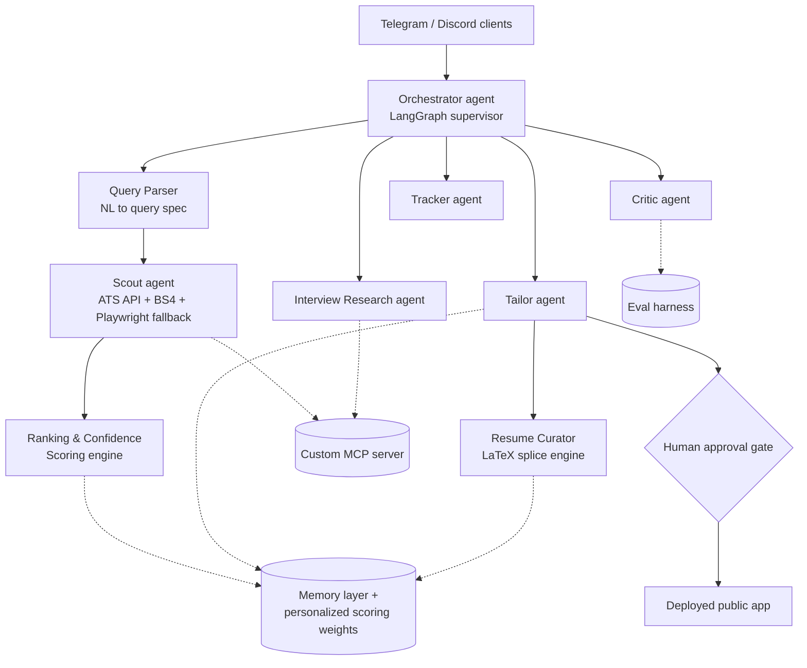

# Career Ops Copilot — Software Requirements Specification (SRS)

**Document purpose**: Complete, living specification for Career Ops Copilot, written to be fed directly into an AI IDE for step-by-step implementation. Covers the full flagship scope, phase-tagged so features not built yet are still fully specified. Edit this document directly as decisions change.

**Phase tags**: `[P1]` MVP core loop · `[P2]` scraper upgrade + interview research + query engine · `[P3]` memory + evaluation harness + self-improving scoring · `[P4]` MCP server, multi-platform, monetization, public-readiness · `[P5]` harden/deploy/document.

---

## 0. Competitive Research Notes

Before specifying requirements, here's what direct competitors do and where this system deliberately differs — this shapes several decisions below.

**Jobright.ai** (~$5M ARR, 9-person team) is the closest existing analog: resume upload → AI match score (70-100%) against aggregated listings → resume tailoring → autofill/autoapply. Independent reviews surface two recurring failure modes worth designing around from day one:
1. **Resume/cover-letter hallucination** — the AI invents experience or locations not in the candidate's background, sometimes producing "confident fiction." This is exactly what the Critic agent (§5.5) exists to catch, and validates that guardrail as a real differentiator, not overengineering.
2. **Score inconsistency across surfaces** — Jobright's Chrome extension sometimes shows a different match score than the main platform for the same job, because scoring is computed separately in each place. **Design principle**: all surfaces (web, Telegram, Discord) must call the same backend scoring logic — never reimplement scoring per client.

Jobright's free tier is widely criticized as too restrictive (exhausted in one session), pushing users hard toward $18-40/month plans with no trial. This system should be more generous on the free tier (§ Monetization below) — not chasing VC-scale revenue, and a fair free tier is a better trust signal and a better interview story than a paywall-heavy one.

Jobright pushes toward full autoapply. **This system deliberately does not** — the manual-approval gate (§5.6) is a trust-by-design choice, positioned explicitly against the "autoapply produces confident fiction" failure mode competitors are being called out for.

**Resume tailoring competitors** (ApplyTeX, ResumeTailor, VeloCV, Ryusume, JobShinobi) converge on the same technical pattern for format-preserving tailoring: parse a `.tex` source into addressable statements with stable IDs and exact character spans, rewrite only relevant statements grounded in evidence (never inventing skills/employers/metrics), splice edits back into the *original* source, recompile. Notably, even funded competitors either require a `.tex` source upfront or explicitly list PDF-to-LaTeX reconstruction as "planned for a future release" — true reverse-engineering of an arbitrary PDF's exact visual layout into equivalent LaTeX is still an unsolved problem industry-wide, not a gap unique to a student project. This directly informs §7's resume curator design.

**Recommendation-systems research** on cold-start and implicit feedback (matrix factorization, Bayesian personalized ranking, etc.) is built for population-scale, multi-user interaction data — thousands of users generating overlapping signals. That's the wrong tool here: a new product with a modest user base doesn't have the interaction volume those methods need, and using them anyway would be a mismatch between technique and data regime, not sophistication. §"Self-Improving Scoring Design" below explains the lighter-weight approach chosen instead.

---

## 1. Introduction

### 1.1 Purpose
Career Ops Copilot is a multi-agent system that automates the tedious parts of job hunting — discovery, tailoring, interview research — while keeping the human in control of every submission.

### 1.2 Scope
Finds job openings (including via complex natural-language queries), scores and ranks them with an explained confidence score, drafts tailored application materials on demand, researches how a target company structures its interviews, tracks the full pipeline, and improves its own ranking quality over time using real outcome data. Deployed publicly, with a free tier and a low-cost paid tier, and accessible via web, Telegram, and Discord.

### 1.3 Out of scope
- Auto-submitting applications on a user's behalf, under any circumstance — this is a permanent design choice, not a missing feature
- Guaranteeing exact, verbatim interview questions (structure and general themes only)
- True PDF→LaTeX visual reconstruction for resumes with no LaTeX source (see §7 — unsolved industry-wide)
- Full interview-coaching/prep (only interview *research*, see §5.8)
- Training any model on user data without explicit, separate opt-in consent

### 1.4 Definitions
- **JD** — Job Description · **ATS** — Applicant Tracking System · **Fit-score** — a predicted, explained match quality between a user's profile/query and a JD · **Golden dataset** — curated test cases for scoring agent behavior · **Query spec** — the structured set of constraints extracted from a natural-language search query

### 1.5 Intended audience
Primary: an AI IDE implementing this system step by step. Secondary: the builder, for tracking scope and revisiting decisions.

---

## 2. Overall Description

### 2.1 Product perspective
Built from a real, personal pain point: low reply rates on applications sent without company-specific tailoring or interview preparation.

### 2.2 Feature list (all phases)
- Natural-language and filtered job discovery, resume-optional `[P1]`
- Complex query understanding with explained, confidence-scored ranked results `[P2]`
- ATS-aware discovery (Greenhouse/Lever/Workday JSON APIs) + Playwright fallback for JS-heavy sites `[P2]`
- On-demand resume/cover-letter tailoring per JD `[P1]`
- Format-preserving resume curation (LaTeX statement-splice) `[P2]`
- Hallucination/fact-check guardrail on tailored output `[P1]`
- Human approval gate before anything is marked "applied" `[P1]`
- Application pipeline tracker/dashboard, UX researched deliberately `[P1]`
- On-demand company interview-structure research with example question types `[P2]`
- Self-improving, personalized fit-scoring using real outcome data `[P3]`
- Custom persistent memory layer `[P3]`
- Trajectory-based evaluation harness `[P3]`
- Custom MCP server `[P4]`
- Telegram and Discord bot clients on the same backend `[P4]`
- Free + low-cost paid tier `[P4]`
- Per-user rate limiting / cost control `[P4]`
- Privacy controls, explicit no-training-on-user-data commitment `[P4]`

### 2.3 User classes
- **Guest** — sees the landing page (with a pipeline-flow demo, §6.1), cannot access agents
- **Free registered user** — resume-based search, basic confidence scoring, basic tracker, capped daily complex queries, basic memory
- **Paid registered user** — higher/uncapped complex-query allowance, resume curation downloads, full interview research, full long-term memory/self-improving personalization, Telegram/Discord access
- *(No admin/moderator role in scope for the capstone version.)*

### 2.4 Operating environment
Web application (frontend TBD — React/Next.js or another modern framework, see §11), plus Telegram and Discord bot clients calling the same backend. Backend: FastAPI. Hosted on a free-tier PaaS or GCP Cloud Run.

### 2.5 Design & implementation constraints
- **LLM budget**: willing to use a cheap agentic LLM API (not free-tier-only) via OpenRouter — see §2.6. Whatever specific model is chosen, tool/function-calling support is a hard requirement, not a quality preference.
- **Manual-submit-only is a deliberate security/trust design choice, not a budget or technical constraint.** No agent may ever mark an application "applied" without explicit user action — this holds even if autoapply becomes technically trivial later.
- **Local model inference is not in current scope** — may be explored later once the system is stable, but every LLM call currently routes through OpenRouter.
- Company career-page scraping must respect robots.txt and reasonable rate limits
- Interview-structure research must never present exact leaked questions as verified fact — themes and structure only

### 2.6 Assumptions & dependencies
- **OpenRouter** is the single LLM gateway for all model calls — gives access to many providers/models (including free-tier models) through one API, and unlocks additional free-model call volume once credits are added. The specific model(s) used per task are the builder's own choice and are out of scope for this document to prescribe.
- Public web search and community sources (Reddit, LeetCode Discuss) remain accessible for interview research
- Company career pages remain reachable via HTTP or Playwright-rendered fetch

---

## 3. End-to-end user journey (step-by-step)

1. **Landing** — visitor sees a pipeline-flow demo (found → tailored → applied → interviewing → resolved) rendered like a modern SaaS product page, then signs up. `[P4]`
2. **Getting started** — resume upload is the primary path but is *not* required to start; a user can go straight to a natural-language query with no resume on file. Whether a structured profile form is *also* offered is an open item the builder will evaluate separately (§11) — not built now. `[P1]`
3. **Job search via natural language** — the query engine must handle genuinely complex requests, for example:
   - *"find me jobs acc to my resume that is posted within this week"*
   - *"find me jobs posted within a week or two that are not high-level companies, since as an intern I have a higher chance at mid-to-low-level companies"*
   - *"find me jobs that best suit my stack of projects — e.g. if I built something similar to what a company builds, my interest and eligibility align better and I have a better chance"*
   - *"find me java backend jobs specifically from fintech companies"*
   - *"find me jobs from companies already in my resume where I have a better chance of progressing career-wise"*

   Every one of these can also be asked *after* a resume is on file, which sharpens the matching further. `[P2]`
4. **Ranked results with confidence scores and reasoning** — see the dedicated design section below. Results are always shown as a ranked list with a confidence score per job and a short explanation of *why* each job was selected, grounded in the parsed query. `[P2]`
5. **Reviewing a single job** — tailored resume/cover-letter drafting happens **only on demand**, per job the user actively opens — never automatically for every scouted result, to preserve LLM budget. `[P1]`
6. **Researching the company** — on-demand interview-structure lookup: rounds, general question themes with example difficulty/topic ("this company asks medium-to-hard array questions in its first technical round"), or an honest "insufficient information found." `[P2]`
7. **Approving** — user edits the draft as needed and clicks "Mark as Applied" — the only way status changes. `[P1]`
8. **Tracking** — moves into the tracker/pipeline board; user updates status manually. `[P1]`
9. **Outcome feedback loop** — outcomes (interview/reject/offer/no response) feed the memory layer and personalized scoring — see the dedicated design section below. `[P3]`
10. **Ongoing use, multi-platform** — regular use via web, and (for paid users) Telegram/Discord for quick searches and status checks. `[P4]`

---

## 4. System Architecture

Solid arrows: orchestration/data flow. Dashed arrows: shared services each module draws on. `BOT` clients call the *same* orchestrator as the web app — never a separately reimplemented scoring or agent path, per the Jobright score-consistency lesson (§0).

---

## 5. Complex Query Understanding & Confidence Scoring — Design

This satisfies the requirement that both (1) resume-based multi-job display with confidence scores, and (2) graceful handling of complex queries with sparse results, are Claude-designed implementation decisions.

**Query parsing** — one LLM call converts the natural-language query into a structured `query_spec`: hard filters (posting recency window, explicit tech-stack keywords, explicit company name if named) and soft preferences (company-tier/seniority preference, project-domain similarity, "better long-term career fit" framing). Hard filters are applied first as real filters against retrieved postings; soft preferences become *weighted scoring factors*, never hard cutoffs — this is what prevents empty results from an over-specific query.

**Scoring** — every candidate job gets a fit-score computed from:
1. A content-based baseline: semantic similarity between the job's requirements and the user's resume/profile facts (embedding-based)
2. Structured signal boosts/penalties from the query_spec's soft preferences (e.g. "mid-to-low-level company" preference, "similar to my project's domain" preference, explicit tech-stack match)
3. `[P3]` A personalized adjustment layer learned from this specific user's own logged outcomes (see next section) — absent early on, phased in once outcome data exists

**Always show a ranked list, never a blank result** — if hard filters plus soft-preference scoring leave very few strong matches, the system relaxes soft preferences (never hard filters) and shows the next-best candidates with visibly lower confidence scores, and states plainly that constraints were relaxed (e.g. "no exact fintech matches this week — showing top general backend Java roles instead, confidence scores reflect the looser match").

**Explainability is mandatory, not optional** — each result carries a short, grounded explanation referencing the *specific* query_spec factors that drove its score (e.g. "Matches your Java + Spring Boot background; posted 3 days ago; mid-size fintech, which fits your stated preference for higher-response-rate company tiers"). Generated in the same synthesis step as the score, from the same underlying factors — never a vague, ungrounded blurb.

---

## 6. Self-Improving Scoring Design

Marked in the original scope as "needs to be figured out completely" — here is the complete design, deliberately scoped to what a single-product, moderate-user-base system can actually support (see §0 for why classical collaborative filtering is the wrong tool here).

**What is NOT used, and why**: matrix factorization / Bayesian personalized ranking / collaborative filtering. These techniques learn from *cross-user* interaction patterns at population scale — they need many users generating overlapping signals to find useful latent structure, and are famously bad exactly in the cold-start regime this product starts in. Using them here would be a mismatch between technique and data volume, not a sign of sophistication.

**What is used instead**: a two-layer scoring model, already introduced in §5.
- **Layer 1 (content-based, day-one usable)**: semantic similarity + structured query_spec signals. Works from a user's very first search, no history needed.
- **Layer 2 (personalized correction, phased in per user)**: as a user logs real outcomes (applied → interview → offer/reject/no-response) through the tracker, a lightweight per-user weighted-adjustment model learns which *structured signals* (company tier, tech-stack overlap type, project-domain similarity, recency) actually correlate with that specific user's positive outcomes, and nudges future scores accordingly. This is closer to online logistic-regression-style feature reweighting than deep collaborative filtering — appropriately small for the amount of labeled data one user will realistically generate in a semester.

**Recalibration cadence**: rather than continuous live gradient updates (unnecessary complexity, harder to debug/explain), personalized weights are recalculated on a scheduled or on-demand basis (e.g. after every N new logged outcomes) — simpler, reproducible, and directly testable by the evaluation harness (§ from the original P3 scope).

**Cold start for a brand-new user**: falls back entirely to Layer 1 until enough outcome data exists (a small minimum threshold, e.g. 5-10 logged outcomes) — never attempts personalization on data too sparse to learn from.

---

## 7. Resume Curator — Design

**Constraint, restated precisely**: this is *curation*, not regeneration. Minor, targeted edits only — never disturb the resume's existing formatting or structure, and layer in JD-relevant content without rewriting wholesale.

**Chosen approach (industry-converged pattern, see §0)**: statement-level, provenance-tracked splicing.
1. Parse the resume's LaTeX source into addressable statements (bullets, summary, skills lines), each with a stable ID and exact character span in the original source
2. Compare against the JD; identify which specific statements are worth tailoring
3. Rewrite *only* those statements, grounded strictly in facts already present in the user's stored profile — never inventing skills, employers, metrics, or experience not already there (this is the Critic agent's job to verify, §5.5)
4. Splice the edited statements back into the *original* source at their exact spans — nothing else in the document is touched
5. Recompile to PDF for preview and download

**The open fork (flagged for the builder, see closing questions)**: this pattern requires a `.tex` source to begin with. Even funded competitors (ResumeTailor, etc.) either require `.tex` input directly or explicitly list PDF→LaTeX reconstruction as an unsolved future feature — reliably reverse-engineering an arbitrary PDF's exact visual layout into equivalent LaTeX is not a solved problem industry-wide. Two honest options for a user who only has a PDF/Word resume:
- **(a)** Ask them to also provide a `.tex` source or Overleaf project if they have one (plausible for much of this product's target audience — many CS students already write resumes in LaTeX)
- **(b)** For PDF/Word-only uploads, fall back to mapping extracted content into a clean, pre-built one-page ATS-friendly LaTeX template — honestly presented as a *new* clean layout, not a promise to preserve their original exact design (unlike some competitor marketing copy, which overstates this)

---

## 8. Multi-Platform Access & Monetization

**Telegram and Discord bot clients** `[P4]` are thin clients only — they call the exact same orchestrator, scoring, and agent logic as the web app. No platform-specific reimplementation of scoring or ranking, per the Jobright score-consistency lesson (§0).

**Freemium split (starting proposal, adjustable)**:
| Tier | Includes |
|---|---|
| Free | Resume-based and simple natural-language search, basic confidence scoring, basic tracker, a capped number of complex/soft-preference queries per day, short-window basic memory |
| Paid (low-cost) | Higher/uncapped complex-query allowance, resume curation (LaTeX tailoring + download), full interview-structure research, full long-term memory + personalized/self-improving scoring, Telegram/Discord access |

Kept deliberately more generous on the free tier than Jobright's criticized approach (§0) — a fair free tier is a better trust signal, and a better interview story, than a paywall-heavy one. Exact pricing and the precise feature boundary are explicitly left open for later refinement, per the builder's own note.

---

## 9. Functional Requirements

### 9.1 Authentication & Accounts `[P4]`
- FR-AUTH-1: Users register via email/password or Google OAuth
- FR-AUTH-2: Data scoped by `user_id`, never visible across users
- FR-AUTH-3: A user can delete their account and all associated data
- FR-AUTH-4: Tier (free/paid) gates feature access per §8's table

### 9.2 Getting Started `[P1]`
- FR-START-1: Resume upload is optional, not required, to perform a search
- FR-START-2: If a resume is uploaded, extract structured facts for use in tailoring and scoring
- FR-START-3: A structured onboarding profile form is explicitly *not* built now — deferred pending separate evaluation

### 9.3 Query Parser `[P2]`
- FR-QUERY-1: Parse a natural-language query into hard filters + soft preference weights (§5)
- FR-QUERY-2: Hard filters apply as real filters; soft preferences never produce a hard cutoff
- *Acceptance*: the five example queries in §3 each produce a distinct, correctly-structured query_spec

### 9.4 Scout Agent `[P1, ATS + Playwright P2]`
- FR-SCOUT-1: Tool contract: `search_jobs(query_spec: dict, limit: int = 10) -> list[dict]`
- FR-SCOUT-2: Check `known_ats` lookup first (Greenhouse/Lever/Workday JSON APIs); fall back to BS4 for static pages; fall back further to Playwright for JS-heavy sites with no API
- FR-SCOUT-3: Deduplicate against jobs already in the user's tracker

### 9.5 Ranking & Confidence Scoring `[P2, personalization P3]`
- FR-RANK-1: Every candidate gets a fit-score per §5's model
- FR-RANK-2: Always return a ranked list; relax soft preferences (never hard filters) rather than return empty results
- FR-RANK-3: Every result carries a grounded, query_spec-referencing explanation
- *Acceptance*: an intentionally over-specific query still returns a non-empty, honestly-lower-confidence ranked list with a stated relaxation note

### 9.6 Tailor Agent `[P1]`
- FR-TAILOR-1: Drafts resume bullets/cover letter **only on user demand, per single job** — never automatically across all scouted results
- FR-TAILOR-2: Output is always a draft; never changes application status

### 9.7 Resume Curator `[P2]`
- FR-CURATOR-1: For `.tex`-sourced resumes, use statement-level splice editing (§7) — original formatting untouched outside edited spans
- FR-CURATOR-2: For PDF/Word-only resumes, fall back to a clean pre-built LaTeX template, honestly labeled as a new layout
- FR-CURATOR-3: Output is a downloadable, rendered PDF plus the underlying `.tex`
- *Acceptance*: a `.tex` upload tailored against two different JDs produces two outputs with identical formatting/macros outside the edited bullets

### 9.8 Critic Agent `[P1]`
- FR-CRITIC-1: Fact-check tailor/curator output against stored profile; flag any unverifiable claim
- FR-CRITIC-2: Contribute to the fit-score's content-based layer

### 9.9 Human Approval Gate `[P1]`
- FR-GATE-1: No application may become "applied" without explicit user action — a permanent design decision (§2.5), not a configurable setting

### 9.10 Tracker & Dashboard `[P1]`
- FR-TRACK-1: Pipeline state: found → tailored → applied → interviewing → resolved
- FR-TRACK-2: UX must be easily understandable and trackable at a glance — flagged as requiring dedicated UX research before final implementation, not fully specified yet

### 9.11 Interview Research `[P2]`
(Renamed from "Prep Agent" — scope is interview *research* only, not full interview coaching; no DSA-practice tie-in.)
- FR-IR-1: Tool contract: `research_interview_structure(company: str) -> InterviewStructure`
- FR-IR-2: Output includes round structure *and* example question types/difficulty per round (e.g. "medium-to-hard array/DP questions typical in round 1"), not just structure
- FR-IR-3: Fixed query templates (general + community-source-targeted), single synthesis call, shared cache across all users, on-demand only, honest "insufficient information" fallback

### 9.12 Orchestrator `[P1]`
- FR-ORCH-1: LangGraph supervisor routes to the correct module; only it invokes the human approval gate

### 9.13 Memory Layer `[P3]`
- FR-MEM-1: Extract/consolidate facts from resume + logged outcomes
- FR-MEM-2: Store the personalized scoring-adjustment weights described in §6

### 9.14 Evaluation Harness `[P3]`
- FR-EVAL-1: Golden dataset scoring tool-call correctness and ranking quality, not just final output
- FR-EVAL-2: Specifically test the "relax soft preferences, never hard filters" behavior (§5) against adversarial over-specific queries

### 9.15 Custom MCP Server `[P4]`
- FR-MCP-1: Expose `search_jobs`, `parse_job_description`, `get_user_resume_facts`, `research_interview_structure` as MCP tools

### 9.16 Multi-Platform Clients `[P4]`
- FR-BOT-1: Telegram/Discord clients call the same orchestrator/scoring path as web — no separate reimplementation

### 9.17 Rate Limiting & Monetization Gating `[P4]`
- FR-RATE-1: Per-user daily cap on LLM-backed actions, enforced in code
- FR-RATE-2: A separate pay-gated cap/feature-lock for paid-only features (§8)

### 9.18 Privacy & Data Handling `[P4]`
- FR-PRIV-1: User-triggered data deletion
- FR-PRIV-2: Plain-language privacy notice at signup
- FR-PRIV-3: **User data is never used to train any model, under any tier, without a separate and explicit opt-in** — this is a stated commitment, not a "maybe later" gray area

---

## 10. UI/UX Specification

Full screen-by-screen UX is intentionally *not* fully specified yet — §9.10 flags that good, trackable UX is mandatory and needs dedicated research before final design, to be done step by step as the product is built. What's decided now:

### 10.1 Landing page `[P4]`
Must include a pipeline-flow demo — a visual walkthrough (found → tailored → applied → interviewing → resolved) in the style of modern SaaS landing pages, so the product's function is obvious at a glance before signup.

### 10.2 Sign up / Login `[P4]`
Standard email/password or Google OAuth. States: default, error, loading.

*(Remaining screens — search, job detail, tracker, settings — will be researched and specified screen-by-screen as building proceeds, rather than locked in speculatively now.)*

---

## 11. Data Models

| Entity | Key fields | Notes |
|---|---|---|
| User | id, email, auth_provider, tier (free/paid), created_at | |
| ResumeProfile | user_id, raw_resume_text, latex_source (nullable), structured_facts (json) | `latex_source` present only if user supplied `.tex` |
| JobPosting | id, user_id, title, company, location, url, snippet, source (ats/bs4/playwright), found_at | |
| Application | job_id, status, tailored_resume, tailored_cover_letter, fit_score, explanation, applied_at, outcome | `explanation` is the grounded per-job reasoning text |
| InterviewResearchCache | company (unique), rounds (json incl. example question types), difficulty_note, researched_at | shared across all users |
| MemoryFact | user_id, fact_text, fact_type, source, updated_at | |
| ScoringWeights | user_id, weights (json), last_recalibrated_at, outcome_count | personalized Layer 2 adjustment (§6) |
| EvalRun | id, timestamp, test_case_id, score, notes | |

---

## 12. External Interfaces / Tool Contracts

- `search_jobs(query_spec: dict, limit: int = 10) -> list[dict]` `[P1/P2]`
- `research_interview_structure(company: str) -> InterviewStructure` `[P2]`
- LLM access: **OpenRouter**, single gateway for all model calls; specific model selection is the builder's own choice, contingent only on tool/function-calling support
- MCP server tools (§9.15) `[P4]`

---

## 13. Non-Functional Requirements

### 13.1 Performance
Simple searches/actions should feel fast (a few seconds). Complex, multi-constraint queries involving query parsing + broad retrieval + scoring are expected to reasonably take on the order of a few minutes, not seconds — this is an accepted tradeoff, not a defect.

### 13.2 Scalability & Cost
Per-user daily rate limits (§9.17) plus tier gating (§8) are the primary scaling controls. The shared interview-research cache (§9.11) is the primary cost control for that specific feature.

### 13.3 Security & Privacy
Per-user data isolation mandatory. Basic hygiene — encrypted storage, user-triggered deletion, plain privacy notice, and an explicit no-training-on-user-data commitment (§9.18) — not full enterprise compliance certification.

### 13.4 Reliability
Agents fail gracefully and honestly: interview research says "insufficient information" rather than fabricating; the ranking engine relaxes soft constraints rather than returning nothing or fabricating fake matches; the critic agent actually blocks unverified resume claims.

### 13.5 Usability
Mandatory, not optional (per builder's explicit note) — a trackable, understandable UX is treated as a first-class requirement, with dedicated research time allocated rather than being an afterthought.

### 13.6 Maintainability
Each agent/module is a separable LangGraph node with its own clear contract (§12), independently modifiable.

---

## 14. Phased Build Roadmap

| Phase | Content |
|---|---|
| P1 | Foundation, orchestrator skeleton, resume-optional onboarding, basic scout/tailor/critic/tracker (on-demand tailoring), approval gate |
| P2 | Complex query parser, confidence scoring engine (Layer 1), ATS-aware scraping + Playwright fallback, interview research (with example question types), resume curator (LaTeX splice engine) |
| P3 | Memory layer, personalized scoring (Layer 2, self-improving), evaluation harness |
| P4 | Custom MCP server, auth + tiering, Telegram/Discord clients, rate limiting/monetization gating, privacy commitments, public-readiness |
| P5 | Harden, deploy, demo video, write-up |

Open to splitting any phase further once implementation reveals where the real complexity lands — this structure is a starting shape, not a locked commitment.

---

## 15. Open Questions

- **Frontend framework**: React/Next.js vs. another modern framework (Svelte/SvelteKit, Vue/Nuxt) — builder prefers "another" but hasn't named one; needs a decision before UX work in P2-P3 begins in earnest
- **Resume curator input fork** (§7): require `.tex`/Overleaf input for true format-preserving curation, vs. build the clean-template fallback for PDF/Word-only uploads, vs. both from the start
- **Telegram/Discord timing**: build alongside core web app earlier, or strictly after the web product and monetization model are validated (currently phased at P4)
- Structured onboarding profile form — explicitly deferred pending separate evaluation (§9.2)
- Exact free/paid feature boundary and pricing (§8) — deliberately left open
- Whether DSA-practice tie-in is fully removed or could return in a different, non-interview-research form later
