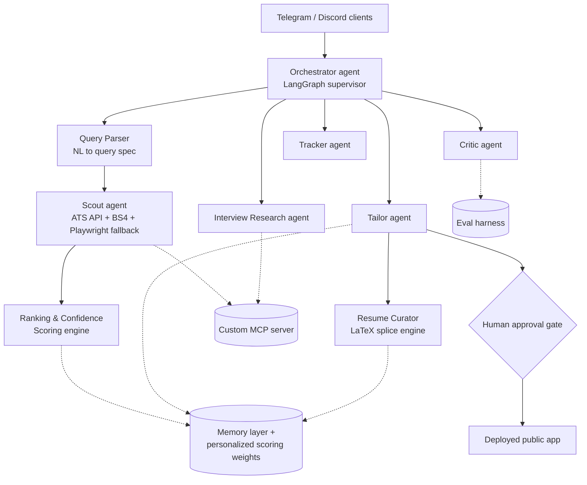

# Architecture Overview

Solid arrows: orchestration/data flow. Dashed arrows: shared services each module draws on.
`BOT` clients (`[P4]`) call the *same* orchestrator as the web app — never a separately reimplemented scoring or agent path (see `/docs/competitive-analysis.md` — this is directly why Jobright's extension and web app showed different scores for the same job).

## Phase tags used throughout /spec
`[P1]` foundation/core loop · `[P2]` query engine + ATS scraping + interview research + resume curator · `[P3]` memory + eval harness + self-improving scoring · `[P4]` MCP server, multi-platform, monetization, public-readiness · `[P5]` harden/deploy/document.

## Module → spec file map
- Orchestrator + human approval gate + getting-started → `orchestrator-and-gate.md`
- Scout agent (job discovery) → `scout-agent.md`
- Query parsing + confidence scoring + self-improving personalization → `query-and-scoring.md`
- Tailor + Critic agents → `tailor-and-critic.md`
- Resume curator (LaTeX) → `resume-curator.md`
- Interview research → `interview-research.md`
- Tracker/dashboard UX → `tracker-ux.md`
- Data models (all entities) → `data-models.md`
- Everything P3/P4 (memory, eval, MCP, multi-platform, monetization, auth, privacy, remaining NFRs) → `later-phases.md`
